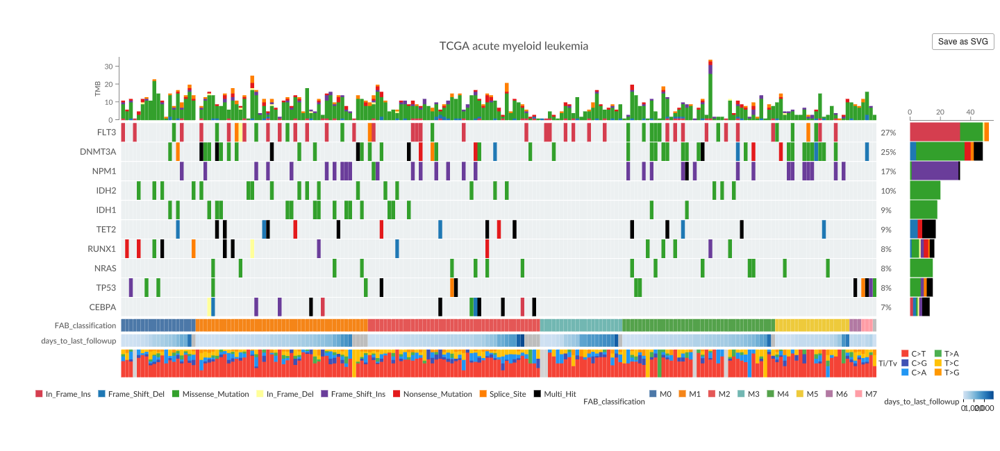

# MutGlyph

<!-- badges: start -->
[](https://lifecycle.r-lib.org/articles/stages.html#experimental)
[](LICENSE)
<!-- badges: end -->

MutGlyph is an R package focused exclusively on cancer-genomics
visualization. It provides interactive,
[GenomeSpy](https://genomespy.app/)-based counterparts to established
[`maftools`](https://bioconductor.org/packages/maftools/) plots,
including oncoplots, protein lollipop plots, rainfall plots, and GISTIC
copy-number landscapes.

MutGlyph does not call variants or replace the general analysis and
data-processing functionality of maftools. Its own transformations and
summaries are limited to constructing visualizations. It turns existing MAF
and GISTIC objects—plus ordinary data frames where appropriate—into responsive
htmlwidgets with tooltips, zooming, panning, fullscreen viewing, and PNG or SVG
export.



## Installation

MutGlyph is under development and is not yet on CRAN or Bioconductor. Install
it from GitHub with [pak](https://pak.r-lib.org/):

```r
install.packages("pak")
pak::pak("genome-spy/MutGlyph")
```

## Quick start

The maftools package includes a small TCGA acute myeloid leukemia MAF:

```r
laml <- maftools::read.maf(
  maf = system.file("extdata", "tcga_laml.maf.gz", package = "maftools"),
  clinicalData = system.file(
    "extdata",
    "tcga_laml_annot.tsv",
    package = "maftools"
  ),
  verbose = FALSE
)
```

`MutGlyph::oncoplot()` deliberately follows the familiar
`maftools::oncoplot()` API. For a common call, switching to interactive output
requires only changing the namespace:

```r
# Static plot
maftools::oncoplot(maf = laml, top = 10)

# Interactive GenomeSpy widget
MutGlyph::oncoplot(maf = laml, top = 10)
```

Scroll or pinch over the matrix to navigate the shared sample scale and hover
over marks for details. Hovering over the widget also reveals controls for
fullscreen viewing, PNG or SVG image export, and downloading the generated
GenomeSpy specification.

## Familiar visualization APIs

MutGlyph uses established names and common argument semantics so existing
visualization calls are easy to recognize and adapt. For supported common
calls, they are designed as almost drop-in visualization replacements. The
goal is to preserve the familiar plots while adding basic
interactivity—zooming, panning, and tooltips—and cleaner, deliberately
opinionated visual defaults that aim for a subjectively prettier result.

| Static maftools function | Interactive MutGlyph counterpart |
|---|---|
| `maftools::oncoplot()` | `MutGlyph::oncoplot()` |
| `maftools::rainfallPlot()` | `MutGlyph::rainfallPlot()` |
| `maftools::lollipopPlot()` | `MutGlyph::lollipopPlot()` |
| `maftools::lollipopPlot2()` | `MutGlyph::lollipopPlot2()` |
| `maftools::gisticChromPlot()` | `MutGlyph::gisticChromPlot()` |

Compatibility is semantic rather than exhaustive. MutGlyph preserves familiar
inputs, meanings, and defaults where they fit an interactive visualization,
but does not reproduce obscure styling or static-layout arguments that do not
make sense in GenomeSpy.

## Composable visualization inputs

The plotting functions accept standard maftools MAF and GISTIC objects.
Protein lollipop plots additionally accept ordinary mutation tables and custom
domain tables, making it straightforward to combine pre-aggregated data with
local annotations or domains fetched from InterPro. Rainfall and GISTIC plots
accept genomic regions, and the plot builders expose focused data-frame inputs
for custom annotations and summary tracks.

Every plotting function returns an htmlwidget containing the complete
GenomeSpy specification. Retrieve a portable JSON representation for
inspection, versioning, or experimentation in the GenomeSpy Playground:

```r
plot <- MutGlyph::oncoplot(laml, top = 10)
json <- MutGlyph::as_json(plot)
```

## Documentation

- [Get started](https://genomespy.app/MutGlyph/articles/MutGlyph.html) with a
  complete first oncoplot and the shared widget controls.
- [Oncoplots](https://genomespy.app/MutGlyph/articles/oncoplots.html) covers
  selection, clinical tracks, summaries, colors, and GISTIC calls.
- [Protein lollipop plots](https://genomespy.app/MutGlyph/articles/lollipop-plots.html)
  covers single- and two-cohort plots, labels, layouts, and protein domains.
- [Rainfall plots and kataegis](https://genomespy.app/MutGlyph/articles/rainfall-plots.html)
  covers mutation clustering, detected loci, and genomic regions.
- [GISTIC copy-number landscapes](https://genomespy.app/MutGlyph/articles/gistic-plots.html)
  covers chromosome-wide profiles, significance, annotations, and close zooms.
- The [function reference](https://genomespy.app/MutGlyph/reference/index.html)
  documents every public function and data set.

## Development

MutGlyph also provides a working example of embedding GenomeSpy in an R
package: R code constructs the specifications, an htmlwidgets binding hosts
the visualization, and a committed browser bundle supplies the runtime.
Installing, using, and checking the R package therefore requires neither
Node.js nor network access. When changing the browser binding or upgrading
GenomeSpy, run:

```sh
npm install
npm run build
npm run validate:specs
```

Specification validation uses the JSON schema bundled with the pinned
GenomeSpy development dependency. The schema is not included in the released R
package.

See the installed `NOTICE` and `JS-LICENSES` files for attribution of bundled
and adapted work.

## AI-assisted development

OpenAI Codex was used extensively in developing MutGlyph. It assisted with
researching existing solutions, prioritizing and planning features,
bootstrapping the project, refining public APIs, adapting GenomeSpy example
specifications for dynamic generation in R, and producing code, tests,
documentation, and examples.

Development was an iterative human-in-the-loop process. The author defined the
goals and constraints, evaluated alternatives, reviewed and edited changes,
inspected visual output, and verified the implementation through tests. The
author remains responsible for the package's design, correctness, licensing,
maintenance, and scientific use.
